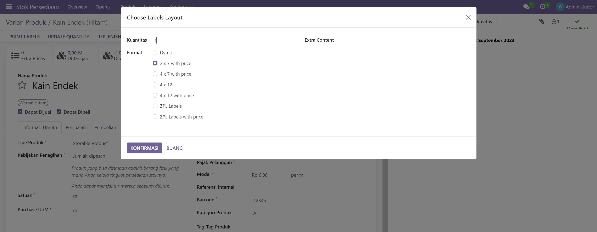

# Produk dan Varian Produk

Untuk menambahkan barcode pada suatu produk yang memiliki varian maupun yang tidak memiliki varian dapat melalui fitur **Stok Persediaan**.&#x20;

<figure><figcaption>
Produk atau Varian Produk
</figcaption></figure>

## **Barcode Produk Tanpa Varian**

Penambahan barcode pada produk dapat melalui **Stok Persediaan > Produk**, selanjutnya ikuti langkah berikut:

1. Pilih produk yang ingin ditambahkan barcode.
2. Isi kolom barcode dengan kode yang ingin dijadikan barcode, biasanya sudah tersedia pada kemasan atau dapat membuat kode mandiri dengan format yang ditentukan oleh perusahaan.


Perlu diingat bahwa barcode harus identik untuk setiap produk atau tidak boleh sama, jika terdapat barcode yang sama antar produk, maka pengubahan tidak dapat disimpan.


3. Simpan pengubahan.

<figure><figcaption>
Menambahkan Barcode pada Produk
</figcaption></figure>

## **Barcode Produk Dengan Varian**

Penambahan barcode pada produk dengan varian dapat melalui **Stok Persediaan > Varian Produk**, selanjutnya ikuti langkah berikut:

1. Pilih varian produk yang ingin ditambahkan barcode.
2. Isi kolom barcode dengan kode yang ingin dijadikan barcode, biasanya sudah tersedia pada kemasan atau dapat membuat kode mandiri dengan format yang ditentukan oleh perusahaan.
3. Simpan pengubahan.

<figure><figcaption>
Menambahkan Barcode pada Varian Produk
</figcaption></figure>


Penambahan barcode dapat dilakukan melalui halaman **Produk** maupun **Varian Produk** karena produk yang muncul pada halaman **Produk** akan muncul juga pada halaman **Varian Produk**.


## Cetak Label

Setelah membuat barcode untuk setiap produk, selanjutnya barcode dapat dicetak untuk ditempelkan pada produk. Berikut langkah-langkah untuk mencetak label barcode:

1. Masuk ke halaman **Stok Persediaan > Produk** atau **Stok Persediaan > Varian Produk** (untuk produk yang memiliki varian) lalu pilih produk yang ingin dicetak label.
2. Pilih **"PRINT LABELS".**
3. Masukkan jumlah dan format label yang ingin diprint.

<figure><figcaption>
Cetak Label
</figcaption></figure>

4. Jika sudah, klik **"KONFIRMASI"**. Maka label akan didownload otomatis dalam format PDF dan siap dicetak menggunakan printer stiker atau label.

<figure><figcaption>
Label Barcode Siap Cetak
</figcaption></figure>
