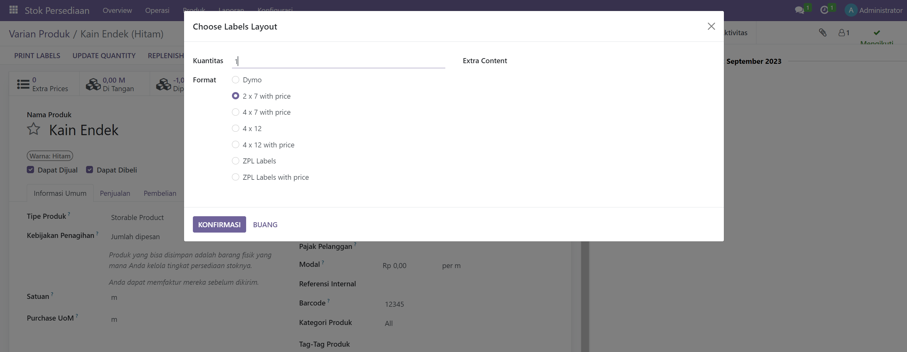

# Penyesuaian per Produk

Penyesuaian stok per produk dapat dilakukan melalui **Stok Persediaan > Produk > Produk**. Selanjutnya bisa mengikuti langkah berikut:

1. Pilih produk yang ingin disesuaikan stoknya.
2. Pilih menu **Update Quantity** untuk melakukan penyesuaian stok.

<figure><figcaption>
Edit Produk
</figcaption></figure>

3. Hitung stok produk yang tersedia (sesuai kenyataan) lalu input stok ke **Kuantitas di Tangan yang Baru** untuk melakukan update stok.

<figure><figcaption>
Penyesuaian Produk
</figcaption></figure>

4. Selanjutnya pilih terapkan, maka stok berhasil disesuaikan.
