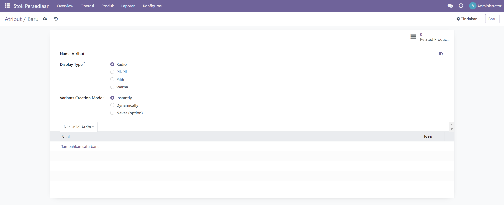
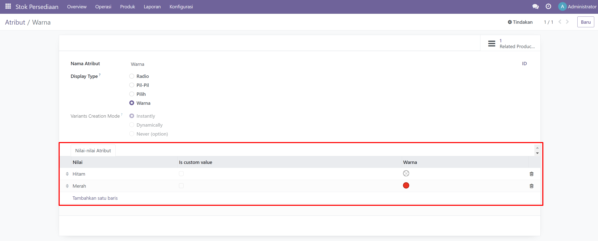
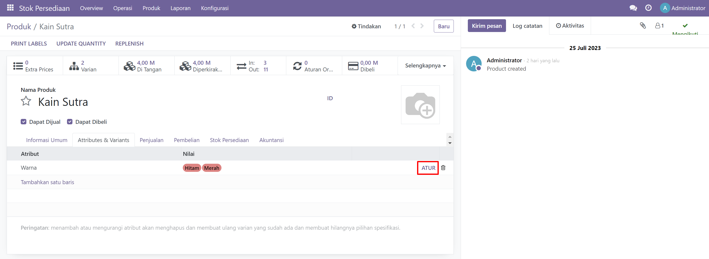
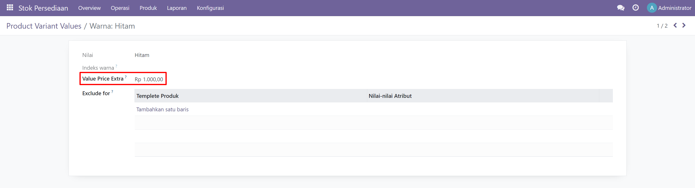

# Varian Produk

Untuk membuat varian dari suatu produk, yang pertama harus dilakukan adalah membuat atribut, dapat dilakukan melalui **Stok Persediaan > Konfigurasi > Atribut**. Buat baru untuk menambahkan atribut baru.

<figure><figcaption>
Buat Atribut Baru
</figcaption></figure>

Contoh ingin menambahkan atribut warna, maka dapat mengikuti langkah berikut:

1. Isi nama atribut "Warna".
2. Pilih display type untuk tampilan pilihan saat memilih atribut nanti, jika ingin menampilkan color picker untuk atribut warna maka dapat memilih display type "Warna".
3. Pilih mode varian, dalam kasus ini menggunakan nilai defaultnya yaitu "Instanly".
4. Menambah nilai atribut yang diinginkan pada tabel "Nilai - Nilai Atribut" dengan klik "Tambahkan satu baris", jika sudah lalu simpan pengubahan yang dibuat.

<figure><figcaption>
Menambahkan Nilai Atribut
</figcaption></figure>

5. Selanjutnya tambahkan atribut pada produk melalui **Stok Persediaan > Produk** lalu pilih produk yang ingin ditambahkan atribut atau buat baru jika belum memiliki produk.
6. Pada tab "Attributes & Variants" tambahkan atribut yang sudah dibuat tadi dan isi kolom nilai sesuai varian yang tersedia untuk produk tersebut, lalu simpan pengubahan.
7. Selanjutnya atur harga penjualan tiap varian dengan memilih "Atur" pada baris atribut yang ingin diatur.

<figure><figcaption>
Menambahkan Varian Produk
</figcaption></figure>

8. Pilih varian yang ingin diatur harganya. Pada isian "Value Price Extra" input ekstra harga varian dari harga produk.

<figure><figcaption>
Mengatur Harga Ekstra Varian
</figcaption></figure>
